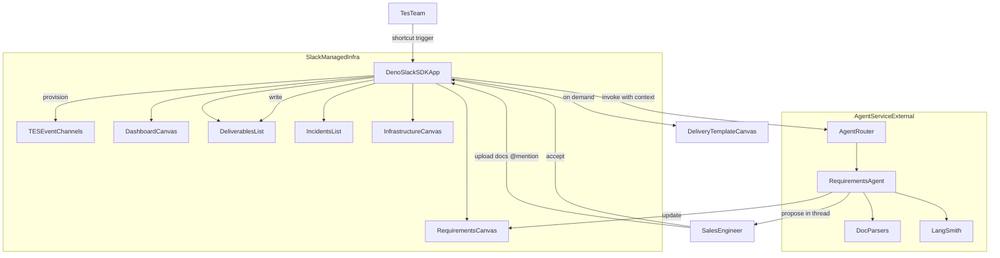

# TES Event Process — Implementation Plan

> **For agentic workers:** REQUIRED SUB-SKILL: Use [subagent-driven-development](.agents/skills/subagent-driven-development/SKILL.md) (recommended) or [executing-plans](.agents/skills/executing-plans/SKILL.md) to implement this plan task-by-task.

**Goal:** Streamline TES event delivery in Slack with a single app that provisions event channels, collects onboarding context, and runs a Requirements Agent that processes raw documents into a Requirements Canvas and review-gated Deliverables List items.

**Architecture:** One Slack app (Deno Slack SDK on Slack-managed infrastructure) owns all Slack integration — channel provisioning, modals, canvases, lists, routing, and the review gate. A minimal external **agent-service** (Node.js + LangGraph.js + LangSmith) handles document parsing, multi-turn reasoning, and clarification loops. All persistent state lives in Slack objects (canvases + lists); no external database.

**Tech Stack:** TypeScript, Deno Slack SDK, LangGraph.js, LangSmith, Slack Canvas/List/Assistant APIs, Node.js 20+ (agent-service only)

## Global Constraints

- Language: TypeScript everywhere
- Slack app hosting: Deno Slack SDK deployed to Slack managed infrastructure
- Data store: Slack-native only (canvases, lists, channel metadata in canvas headers) — no Postgres/Redis
- Channel naming: `#proj-{custom-name}-tes` (custom name chosen at creation)
- Deliverable statuses (exact): Not started, Not needed, Not doable, In progress, Blocked, Validation required, Accepted, Needs clarification
- Agent gate: onboarding must be complete (SailPoint suite selected) before requirements processing
- Agent write gate: never update Deliverables List without explicit user acceptance
- Deliverable integrity: preserve explicit deliverables 1:1; never merge; add similarity analysis notes only
- Document input: accept any Slack-uploadable format; detect and reject unsupported gracefully
- MVP trigger: TES manual shortcut from opportunity channel with minimal pasted context (no Salesforce)
- Dev environment: Slack dev tenant first; Enterprise Grid for production
- Internal agents: one app, multiple LangGraph agents possible; MVP ships Requirements Agent only

---

## Architecture




### Per-channel Slack objects (seeded on creation)


| Object                | Purpose                                                       |
| --------------------- | ------------------------------------------------------------- |
| Dashboard canvas      | Event hub — onboarding data, stakeholders, dates, status      |
| Requirements canvas   | Living requirement memory — agent-maintained between sessions |
| Deliverables list     | Accepted delivery tracker (core schema below)                 |
| Incidents list        | Cross-team support tickets (manual MVP)                       |
| Infrastructure canvas | ISC tenant / env details (skeleton MVP)                       |
| Pinned index message  | Links to all objects + onboarding CTA                         |


### Deliverables list — mandatory core fields

Task ID, Assignee, Status, Situation, Category, Requirements, Due date, Deliverable (canvas link, created on demand)

### Requirements canvas — sections

Scope, Documents processed, Extracted requirements, Deliverable candidates, Analysis notes, Open questions, Session log

### Delivery template canvas — core sections (agent pre-fills on creation)

Overview, Scope, Requirements, Technical approach, Acceptance criteria, Dependencies and risks, Notes and analysis

---

## Repository layout

```
tes-event-process/
├── docs/superpowers/
│   ├── specs/2026-08-04-tes-slack-process-design.md   # design spec (Task 0)
│   └── plans/2026-08-04-tes-slack-process-mvp.md      # this plan
├── slack-app/                    # Deno Slack SDK — Slack-managed deploy
│   ├── manifest.ts
│   ├── functions/
│   ├── workflows/
│   ├── triggers/
│   ├── lib/                      # Slack API helpers (canvas, list, channel)
│   └── templates/                # Canvas markdown seeds
├── agent-service/                # Node.js LangGraph.js service
│   ├── src/
│   │   ├── agents/requirements/
│   │   ├── tools/                # parse docs, format proposals
│   │   ├── parsers/              # pdf, docx, xlsx, text
│   │   └── server.ts             # HTTP endpoint called by Slack app
│   └── tests/
├── packages/shared/              # Shared TS types (compiled for both runtimes)
│   └── src/types/
└── README.md
```

**Shared types strategy:** Define canonical types in `packages/shared` (`TesEventContext`, `OnboardingForm`, `DeliverableItem`, `RequirementsCanvasSections`, `DeliverableStatus`). Agent-service imports via npm workspace. Slack-app copies or imports via Deno `npm:` specifier — pick one approach in Task 1 and use consistently.

---

## Phase 0 — Design spec and project scaffold

### Task 0: Write and commit design spec

**Files:**

- Create: [docs/superpowers/specs/2026-08-04-tes-slack-process-design.md](docs/superpowers/specs/2026-08-04-tes-slack-process-design.md)

Capture all decisions from brainstorming: actors, process flow, channel structure, schemas, agent rules, hosting model, requirements canvas, MVP boundaries, tech stack. Self-review for placeholders and contradictions before commit.

---

### Task 1: Monorepo scaffold and tooling

**Files:**

- Create: [slack-app/manifest.ts](slack-app/manifest.ts), [agent-service/package.json](agent-service/package.json), [packages/shared/package.json](packages/shared/package.json), root [package.json](package.json), [README.md](README.md)
- Create: [packages/shared/src/types/index.ts](packages/shared/src/types/index.ts)

**Interfaces — produces:**

```typescript
// packages/shared/src/types/index.ts
export type DeliverableStatus =
  | "Not started" | "Not needed" | "Not doable" | "In progress"
  | "Blocked" | "Validation required" | "Accepted" | "Needs clarification";

export interface OnboardingForm {
  customerName: string;
  mainProspectGoal: string;
  dealHistory: string;
  projectType: string;
  stakeholders: string;
  competitors: string;
  sailpointSuite: string;
  deadline: string;
  notes: string;
}

export interface TesEventContext {
  channelId: string;
  projectName: string;
  onboardingComplete: boolean;
  onboarding?: OnboardingForm;
  derivedComponents: string[];
  dashboardCanvasId: string;
  requirementsCanvasId: string;
  deliverablesListId: string;
  incidentsListId: string;
  infrastructureCanvasId: string;
}

export interface DeliverableProposal {
  taskId: string;
  category: string;
  requirements: string;
  sourceDocRef: string;
  similarityNotes?: string;
  suggestedStatus: DeliverableStatus;
  openQuestions?: string[];
}
```

- [ ] Scaffold Deno Slack SDK app via `slack create` template
- [ ] Scaffold agent-service with TypeScript, LangGraph.js
- [ ] Add shared types package; wire workspace
- [ ] Add `.env.example` for both services (tokens, LLM key, agent-service URL)
- [ ] Verify: `deno task test` (slack-app) and `npm test` (agent-service) run (empty pass)
- [ ] Commit: `chore: scaffold tes-event-process monorepo`

---

## Phase 1 — Slack app shell (no agent yet)

### Task 2: Channel provisioning trigger

**Files:**

- Create: [slack-app/triggers/create_tes_event.ts](slack-app/triggers/create_tes_event.ts)
- Create: [slack-app/workflows/create_tes_event.ts](slack-app/workflows/create_tes_event.ts)
- Create: [slack-app/functions/provision_channel/definition.ts](slack-app/functions/provision_channel/definition.ts)
- Create: [slack-app/functions/provision_channel/mod.ts](slack-app/functions/provision_channel/mod.ts)
- Create: [slack-app/lib/channel.ts](slack-app/lib/channel.ts)

**Behaviour:**

- TES invokes global shortcut "Create TES Event"
- Modal collects: `projectName` (custom name), optional pasted context (account, AE, SE, notes)
- Creates channel `#proj-{slug(projectName)}-tes`
- Invites TES trigger user + specified AE/SE users
- Calls seed function (Task 3)

**Manifest scopes (minimum):** `channels:manage`, `channels:read`, `chat:write`, `chat:write.public`, `canvases:read`, `canvases:write`, `lists:read`, `lists:write`, `users:read`, `files:read`

- [ ] Write integration test mocking Slack API responses for channel create + invite
- [ ] Implement provision workflow end-to-end
- [ ] Manual test in dev tenant: shortcut → channel created with correct name
- [ ] Commit: `feat: add TES event channel provisioning trigger`

---

### Task 3: Seed channel objects and pinned index

**Files:**

- Create: [slack-app/functions/seed_channel_objects/definition.ts](slack-app/functions/seed_channel_objects/definition.ts)
- Create: [slack-app/functions/seed_channel_objects/mod.ts](slack-app/functions/seed_channel_objects/mod.ts)
- Create: [slack-app/lib/canvas.ts](slack-app/lib/canvas.ts)
- Create: [slack-app/lib/lists.ts](slack-app/lib/lists.ts)
- Create: [slack-app/templates/dashboard.ts](slack-app/templates/dashboard.ts)
- Create: [slack-app/templates/requirements.ts](slack-app/templates/requirements.ts)
- Create: [slack-app/templates/infrastructure.ts](slack-app/templates/infrastructure.ts)
- Create: [slack-app/templates/delivery.ts](slack-app/templates/delivery.ts)

**Behaviour:**

- Create Dashboard, Requirements, Infrastructure canvases from templates
- Create Deliverables and Incidents lists with core column schemas
- Store object IDs in Dashboard canvas metadata block (JSON comment at bottom — Slack-native state pointer)
- Post pinned index message with links + "Complete onboarding" button

**Interfaces — produces:**

```typescript
// slack-app/lib/canvas.ts
export async function createCanvas(client, opts: {
  channelId: string; title: string; markdown: string;
}): Promise<string>; // returns canvasId

export async function updateCanvasSection(client, canvasId: string,
  sectionMarker: string, markdown: string): Promise<void>;
```

- [ ] Test: seed function returns all object IDs
- [ ] Test: dashboard metadata block round-trips `TesEventContext`
- [ ] Manual test: new channel has all objects + pinned index
- [ ] Commit: `feat: seed canvases and lists on channel creation`

---

### Task 4: Onboarding form

**Files:**

- Create: [slack-app/functions/open_onboarding/definition.ts](slack-app/functions/open_onboarding/definition.ts)
- Create: [slack-app/functions/open_onboarding/mod.ts](slack-app/functions/open_onboarding/mod.ts)
- Create: [slack-app/functions/submit_onboarding/definition.ts](slack-app/functions/submit_onboarding/definition.ts)
- Create: [slack-app/functions/submit_onboarding/mod.ts](slack-app/functions/submit_onboarding/mod.ts)
- Create: [slack-app/lib/suite-components.ts](slack-app/lib/suite-components.ts)

**Behaviour:**

- Button in pinned index and `/tes-onboard` open modal with all onboarding fields
- On submit: update Dashboard canvas with opportunity details; set `onboardingComplete: true`; derive technical components from `sailpointSuite` via static mapping in `suite-components.ts`
- Post channel message: onboarding complete, agent now available

**Interfaces — produces:**

```typescript
// slack-app/lib/suite-components.ts
export function deriveComponents(sailpointSuite: string): string[];
```

- [ ] Test: `deriveComponents("Identity Security Cloud")` returns expected module list
- [ ] Test: submit onboarding updates dashboard and flips gate flag
- [ ] Manual test: form → dashboard populated; agent gate opens
- [ ] Commit: `feat: add AE/SE onboarding form`

---

## Phase 2 — Agent service (Requirements Agent)

### Task 5: Document parser pipeline

**Files:**

- Create: [agent-service/src/parsers/index.ts](agent-service/src/parsers/index.ts)
- Create: [agent-service/src/parsers/pdf.ts](agent-service/src/parsers/pdf.ts)
- Create: [agent-service/src/parsers/docx.ts](agent-service/src/parsers/docx.ts)
- Create: [agent-service/src/parsers/xlsx.ts](agent-service/src/parsers/xlsx.ts)
- Create: [agent-service/src/parsers/text.ts](agent-service/src/parsers/text.ts)
- Test: [agent-service/tests/parsers.test.ts](agent-service/tests/parsers.test.ts)

**Interfaces — produces:**

```typescript
export interface ParsedDocument {
  filename: string;
  mimeType: string;
  text: string;
  supported: boolean;
  error?: string;
}

export async function parseDocument(
  buffer: Buffer, filename: string, mimeType: string
): Promise<ParsedDocument>;
```

- [ ] Tests with fixture files for pdf, docx, xlsx, txt
- [ ] Test unsupported format returns `{ supported: false, error }` without throw
- [ ] Commit: `feat: add document parser pipeline`

---

### Task 6: Requirements Agent (LangGraph.js)

**Files:**

- Create: [agent-service/src/agents/requirements/graph.ts](agent-service/src/agents/requirements/graph.ts)
- Create: [agent-service/src/agents/requirements/prompts.ts](agent-service/src/agents/requirements/prompts.ts)
- Create: [agent-service/src/agents/requirements/state.ts](agent-service/src/agents/requirements/state.ts)
- Create: [agent-service/src/tools/propose-deliverables.ts](agent-service/src/tools/propose-deliverables.ts)
- Create: [agent-service/src/tools/update-requirements-canvas.ts](agent-service/src/tools/update-requirements-canvas.ts)
- Create: [agent-service/src/server.ts](agent-service/src/server.ts)
- Test: [agent-service/tests/requirements-agent.test.ts](agent-service/tests/requirements-agent.test.ts)

**Agent graph nodes:**

1. `loadContext` — receive `TesEventContext`, existing requirements canvas markdown, existing deliverables, new docs
2. `parseDocuments` — run parser pipeline
3. `analyzeRequirements` — extract requirements, identify deliverable candidates, similarity notes; enforce no-merge rule
4. `clarifyOrPropose` — if gaps → clarification questions; else → structured proposals
5. `formatOutput` — return `{ updatedRequirementsCanvas, proposals: DeliverableProposal[], message }`

**HTTP endpoint:**

```typescript
POST /agents/requirements/process
Body: { context: TesEventContext, requirementsCanvasMarkdown: string,
        existingDeliverables: DeliverableItem[], files: FilePayload[] }
Response: { updatedCanvas: string, proposals: DeliverableProposal[],
            agentMessage: string, needsClarification: boolean }
```

- [ ] Test: explicit deliverables in input are not merged (eval case)
- [ ] Test: out-of-scope suite components rejected
- [ ] Test: vague input triggers clarification path
- [ ] Commit: `feat: add Requirements Agent with LangGraph`

---

## Phase 3 — Wire agent to Slack app

### Task 7: Agent invocation and Requirements Canvas sync

**Files:**

- Create: [slack-app/functions/invoke_agent/definition.ts](slack-app/functions/invoke_agent/definition.ts)
- Create: [slack-app/functions/invoke_agent/mod.ts](slack-app/functions/invoke_agent/mod.ts)
- Create: [slack-app/lib/agent-client.ts](slack-app/lib/agent-client.ts)
- Create: [slack-app/lib/event-context.ts](slack-app/lib/event-context.ts)
- Modify: [slack-app/manifest.ts](slack-app/manifest.ts) — add `outgoingDomains` for agent-service + LLM

**Behaviour:**

- @mention bot in TES channel (with optional file attachments) → check onboarding gate
- Load `TesEventContext` from dashboard metadata; read Requirements canvas; fetch existing deliverables from list
- Download uploaded files; call agent-service
- Post Block Kit proposal thread; update Requirements canvas with agent output
- Support multi-turn: thread replies re-invoke agent with same context + updated canvas

**Interfaces — consumes:** `POST /agents/requirements/process` from Task 6

- [ ] Test: gate blocks agent when onboarding incomplete
- [ ] Test: successful run updates Requirements canvas
- [ ] Manual test: upload PDF → agent proposes deliverables in thread
- [ ] Commit: `feat: wire Requirements Agent to Slack mentions`

---

### Task 8: Review gate and Deliverables List writes

**Files:**

- Create: [slack-app/functions/accept_proposals/definition.ts](slack-app/functions/accept_proposals/definition.ts)
- Create: [slack-app/functions/accept_proposals/mod.ts](slack-app/functions/accept_proposals/mod.ts)
- Create: [slack-app/lib/deliverables.ts](slack-app/lib/deliverables.ts)
- Modify: [slack-app/functions/invoke_agent/mod.ts](slack-app/functions/invoke_agent/mod.ts) — attach Accept/Edit/Reject buttons to proposal messages

**Behaviour:**

- "Accept all" / "Accept selected" button handlers create list rows with core schema
- Default status: `Not started` (or `Needs clarification` if agent flagged gaps)
- Update Requirements canvas: mark candidates as promoted
- "Reject" dismisses without list write; "Edit" prompts user to reply in thread

**Interfaces — produces:**

```typescript
export async function createDeliverableItem(client, listId: string,
  item: DeliverableItem): Promise<string>; // rowId

export async function createDeliveryCanvas(client, channelId: string,
  deliverable: DeliverableItem): Promise<string>; // canvasId
```

- [ ] Test: accept creates list item; reject does not
- [ ] Test: no write occurs without button interaction
- [ ] Manual test: accept → row appears in Deliverables list
- [ ] Commit: `feat: add review gate and deliverables list writes`

---

### Task 9: On-demand delivery template canvas

**Files:**

- Modify: [slack-app/functions/accept_proposals/mod.ts](slack-app/functions/accept_proposals/mod.ts)
- Create: [slack-app/workflows/create_delivery_canvas.ts](slack-app/workflows/create_delivery_canvas.ts)

**Behaviour:**

- On accept (or separate "Create canvas" button on list row): create Delivery template canvas from [slack-app/templates/delivery.ts](slack-app/templates/delivery.ts), pre-filled from Requirements canvas + proposal
- Link canvas URL in Deliverables list `Deliverable` field
- Do not pre-create canvases for empty rows

- [ ] Test: canvas created and linked on demand only
- [ ] Manual test: accepted deliverable → canvas linked in list
- [ ] Commit: `feat: on-demand delivery template canvas creation`

---

## Phase 4 — Polish, evals, and dev tenant validation

### Task 10: LangSmith eval datasets

**Files:**

- Create: [agent-service/evals/no-merge-rule.json](agent-service/evals/no-merge-rule.json)
- Create: [agent-service/evals/scope-adherence.json](agent-service/evals/scope-adherence.json)
- Create: [agent-service/evals/clarification-triggers.json](agent-service/evals/clarification-triggers.json)
- Create: [agent-service/scripts/run-evals.ts](agent-service/scripts/run-evals.ts)

- [ ] Add 3–5 eval cases per rule from brainstorming
- [ ] Script runs evals against Requirements Agent
- [ ] Document eval workflow in README
- [ ] Commit: `test: add LangSmith eval datasets for agent rules`

---

### Task 11: End-to-end dev tenant smoke test

**Files:**

- Create: [docs/superpowers/plans/2026-08-04-smoke-test-checklist.md](docs/superpowers/plans/2026-08-04-smoke-test-checklist.md)

**Checklist:**

1. TES trigger → channel `#proj-{name}-tes` created with all objects
2. AE/SE completes onboarding → dashboard updated, gate opens
3. SE uploads mixed docs → Requirements canvas updated, proposals in thread
4. Clarification loop works in thread
5. Accept → deliverables appear in list with correct statuses
6. Delivery canvas created on demand and linked
7. Second session extends Requirements canvas (does not overwrite prior work)
8. LangSmith traces visible for all agent runs

- [ ] Run full checklist in Slack dev tenant
- [ ] Fix any blockers found
- [ ] Commit: `docs: add smoke test checklist and results`

---

## Explicitly out of MVP scope (Phase 2+)

- Salesforce / opportunity channel auto-context
- Incidents list automation
- Infrastructure Agent
- OCR for scanned documents
- Slack Workflow Builder integrations beyond basic notifications
- Assistant side panel entry point (channel @mention is MVP primary)
- External database or analytics dashboard
- LangSmith tracing and evals
- LangSmith tracing and evals

---

## Key risks and mitigations


| Risk                                             | Mitigation                                                                                  |
| ------------------------------------------------ | ------------------------------------------------------------------------------------------- |
| Deno Slack SDK vs Bolt Assistant API feature gap | MVP uses @mention + threads; add Assistant side panel in Phase 2 if SDK supports it         |
| Slack List/Canvas API limitations on dev tenant  | Validate API availability in Task 1; fall back to canvas-only tracking if lists unavailable |
| LangGraph.js on Deno                             | Keep agent-service on Node.js; only Slack app on Deno                                       |
| Long doc processing timeouts in Slack functions  | Agent-service handles heavy work; Slack function awaits with status updates in thread       |
| Shared types between Deno and Node               | Single source in `packages/shared`; import via npm specifier in Deno                        |


---

## Self-review (plan vs spec)

- Process flow and actors: Tasks 2–4 (provision), 4 (onboard), 7–9 (agent + review)
- Requirements canvas: Tasks 3 (seed), 7 (sync), 8 (promote candidates)
- Agent rules (gate, no-merge, clarify, review-first): Tasks 4, 6, 7, 8
- Channel naming and statuses: Task 2, shared types Task 1
- Slack-native hosting: Deno SDK in Tasks 1–4, 7–9; external agent only Task 5–6
- MVP boundaries: listed in out-of-scope section

No placeholder tasks remain.


