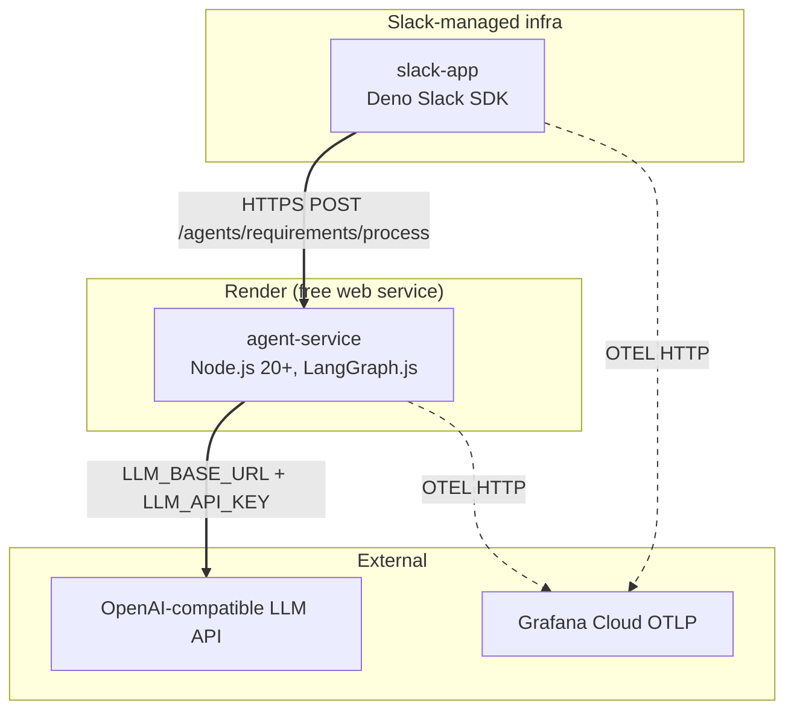

# Architecture — development

## Summary

TES Event Process is a TypeScript monorepo with two runtime services: a **slack-app** (Deno Slack SDK, Slack-managed infra) that handles Slack interactions, and an **agent-service** (Node.js 20+, Render) that runs a LangGraph-based Requirements Agent. Both services share types from `packages/shared` and observability helpers from `packages/observability`. State lives in Slack canvases and lists — no external database.

## Diagram

### Deploy topology

### Container view

Two containers only — C4 not required (fewer than 3 containers).

## Components

| Component | Role | Confidence | Evidence |
|-----------|------|------------|----------|
| `slack-app` | Slack adapter — triggers, modals, canvas/list CRUD, file download, HTTP to agent-service | confirmed | `slack-app/manifest.ts`, `README.md:100` |
| `agent-service` | Document parsing, Requirements Agent (LangGraph), HTTP API | confirmed | `agent-service/src/server.ts`, `README.md:1` |
| `packages/shared` | Shared TypeScript types for both runtimes (e.g. `TesEventContext`, `FilePayload`, `ParsedDocument`) | confirmed | `packages/shared/src/types/index.ts` |
| `packages/observability` | Log event schema, redaction helpers, OTLP JSON payload builder | confirmed | `packages/observability/src/index.ts` |
| LangGraph flow | `loadContext → parseDocuments → analyzeRequirements → clarifyOrPropose → formatOutput` | confirmed | `agent-service/src/agents/requirements/langgraph.ts` |
| Document parsers | TXT/MD (pass-through), DOCX (mammoth), XLSX (sheetjs), PDF (pdf-parse v2) | confirmed | `agent-service/src/parsers/index.ts` |

## Deploy targets

| Target | Platform | Notes |
|--------|----------|-------|
| slack-app | Slack-managed infra (Deno Slack SDK) | Deployed via `slack deploy` CLI; CI uses `SLACK_SERVICE_TOKEN` |
| agent-service | Render (free web service) | Node runtime; build: `npm install && npm run build`; health check path `/health` |
| CI/CD | GitHub Actions | Manual `workflow_dispatch` — validates secrets, syncs Render env vars, deploys both services |

## Data & external services

| Service | Purpose | Env vars (names only) |
|---------|---------|----------------------|
| OpenAI-compatible LLM API | Requirements Agent analysis | `LLM_API_KEY`, `LLM_BASE_URL`, `LLM_MODEL` |
| Grafana Cloud OTLP | Structured log export (optional) | `OTEL_EXPORTER_OTLP_ENDPOINT`, `OTEL_EXPORTER_OTLP_HEADERS`, `OTEL_LOGS_ENABLED`, `OTEL_SERVICE_NAME` |
| Slack API | Bot operations (canvases, lists, files, channels) | `SLACK_BOT_TOKEN`, `SLACK_APP_TOKEN`, `AGENT_SERVICE_URL` |
| Render API | Env var sync from CI | `RENDER_API_KEY`, `RENDER_SERVICE_ID`, `RENDER_DEPLOY_HOOK_URL` |

## Sign-off
- [ ] User approved — pending
