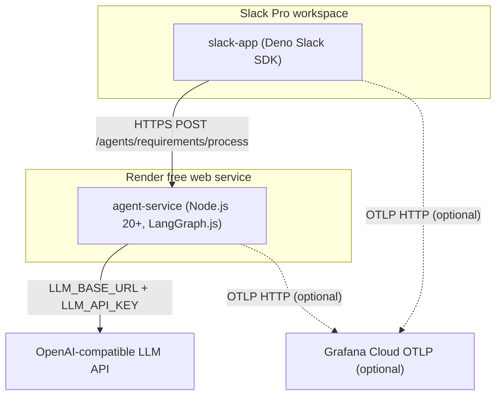

# Architecture — development

## Summary

TES Event Process is a TypeScript monorepo deploying two runtime components: `agent-service` (Node.js 20+ LangGraph API on Render free tier) and `slack-app` (Deno Slack SDK on Slack-managed infrastructure). The agent-service exposes a POST endpoint for document parsing and requirements analysis. slack-app acts as the Slack adapter, forwarding file payloads to agent-service and managing canvases/lists as the source of truth. No external database — all state lives in Slack.

## Diagram

### Deploy topology

### Container view

Two containers only — C4 diagram not required.

## Components

| Component | Role | Confidence | Evidence |
|-----------|------|------------|----------|
| `agent-service` | Node.js 20+ API, LangGraph.js document parsing & requirements analysis | confirmed | `agent-service/package.json`, `render.yaml`, `.github/workflows/deploy.yml` |
| `slack-app` | Deno Slack SDK — Slack adapter, canvas/list CRUD, file download, HTTP to agent-service | confirmed | `slack-app/.env.example`, `README.md`, `render.yaml` |
| `packages/shared` | Shared TypeScript types (HTTP contract, both runtimes) | confirmed | `packages/shared/package.json`, `README.md` |
| `packages/observability` | Log event schema, redaction helpers, OTEL payload builder | confirmed | `packages/observability/package.json`, `README.md` |
| Render | agent-service hosting (free tier) | confirmed | `render.yaml`, `README.md`, deploy workflow |
| Slack Pro workspace | slack-app runtime, Canvas + Lists as state | confirmed | `docs/tech-stack-requirements.md`, `README.md` |
| OpenAI-compatible LLM | Requirements Agent inference | confirmed | `agent-service/.env.example`, `render.yaml` |
| Grafana Cloud OTLP | Optional structured logging | confirmed | `.env.example` files, `render.yaml`, deploy workflow |

## Deploy targets

| Target | Platform | Notes |
|--------|----------|-------|
| agent-service | Render (free web service) | `render.yaml` defines build/start commands, env vars |
| slack-app | Slack-managed (Deno) | Deployed via `slack deploy` CLI with service token |
| CI/CD | GitHub Actions | Manual workflow deploys both services in sequence |

## Data & external services

| Service | Purpose | Env vars (names only) |
|---------|---------|----------------------|
| OpenAI-compatible LLM | Agent inference | `LLM_API_KEY`, `LLM_BASE_URL`, `LLM_MODEL` |
| Render | agent-service hosting | `RENDER_API_KEY`, `RENDER_SERVICE_ID`, `RENDER_DEPLOY_HOOK_URL` |
| Slack | App runtime & deploy | `SLACK_BOT_TOKEN`, `SLACK_APP_TOKEN`, `SLACK_SERVICE_TOKEN` |
| Grafana Cloud | OTLP logging (optional) | `OTEL_EXPORTER_OTLP_ENDPOINT`, `OTEL_EXPORTER_OTLP_HEADERS`, `OTEL_LOGS_ENABLED`, `OTEL_SERVICE_NAME`, `OTEL_RESOURCE_ATTRIBUTES` |

## Sign-off
- [ ] User approved — pending
